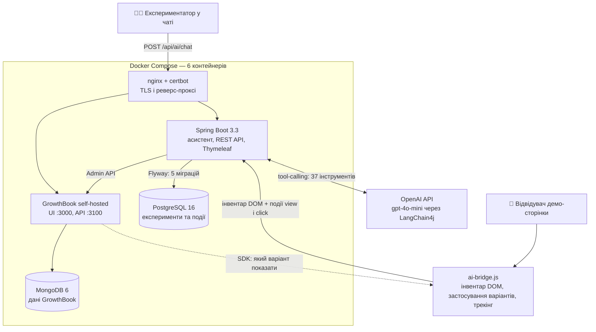

# GrowthBook AI Demo

Демо A/B-платформи на self-hosted GrowthBook з AI-асистентом, який створює і запускає експерименти на сторінці через LLM tool-calling.

> **TL;DR (EN):** A self-hosted A/B testing playground: Spring Boot + GrowthBook + an LLM assistant with 37 tools that plans and runs UI experiments via tool-calling — you type "test a bigger headline" in chat, and it inventories the DOM, creates the experiment, and starts it.

## Що це таке, простими словами?

Уяви, що ти з партнером по інтернет-магазину сперечаєшся, яка кнопка «Купити» працює краще — зелена чи синя. Замість суперечки є чесний спосіб: показати половині відвідувачів зелену, половині синю і порахувати, хто частіше купив. Це називається *A/B-тест*, а платформа, яка ділить людей навпіл і рахує результат, — тут це self-hosted *GrowthBook*.

Зазвичай, щоб запустити такий тест, треба довго клацати по адмінці. Тут замість адмінки — чат. Пишеш людською мовою: «зроби заголовок більшим і перевір, чи клікатимуть частіше» — і AI-помічник сам знаходить цей заголовок на сторінці, пише план, створює експеримент, додає варіанти і запускає. Механізм, яким LLM «тисне справжні кнопки» системи, називається *tool-calling*: модель не просто відповідає текстом, а викликає функції бекенду — у цього асистента їх 37.

Ланцюжок такий: твоя фраза в чаті → план від асистента → виклики інструментів → експеримент у GrowthBook → відвідувачі бачать різні варіанти → цифри капають у PostgreSQL.

## Архітектура



## Можливості

- **Чат-асистент** (`POST /api/ai/chat`): LangChain4j 1.8.0 + OpenAI (`gpt-4o-mini` за замовчуванням, temperature 0.2). До 25 послідовних викликів інструментів на один запит, пам'ять — вікно з 20 повідомлень на HTTP-сесію.
- **56 інструментів у 6 групах** (з них 37 підключено до асистента): інвентар DOM — 8, життєвий цикл експериментів — 26, аналітика — 1, дебаг GrowthBook — 2; окремо написані рецепти DOM-змін — 12 і нативні експерименти GrowthBook з таргетуванням — 7.
- **12 типів варіантів**: зміна тексту, одного CSS-стилю, кількох стилів, HTML, атрибута, картинки, swap двох елементів, reorder, додати/зняти CSS-клас, сховати елемент, контрольний варіант.
- **Життєвий цикл експерименту**: DRAFT → ACTIVE → PAUSED / FINISHED / FAILED / reset, з синхронізацією статусу в GrowthBook. 15 REST-ендпоінтів у `/api/experiments` — все, що вміє асистент, доступно і напряму по API.
- **JS-міст `ai-bridge.js`** (~1000 рядків, без залежностей): інвентаризує елементи сторінки, застосовує варіанти від GrowthBook SDK, шле події view/click на бекенд з дедуплікацією.
- **Дані**: PostgreSQL 16 + Flyway (5 міграцій, 6 таблиць: інвентар, події DOM, експерименти, варіанти, лог подій експериментів, нативні експерименти GB).
- **Інфраструктура**: Docker Compose на 6 сервісів (nginx, certbot, app, growthbook, mongo, events-postgres), автооновлення TLS-сертифікатів кожні 12 годин.
- **CI/CD**: GitHub Actions — push у `main` → SSH на сервер → перезбирання і перезапуск лише контейнера `app`.
- **Демо-сторінка з 9 блоками** (`GET /`) і консоль керування експериментами (`GET /console`).

## Чому це цікаво технічно

- **Системний промпт на ~400 рядків як «конституція» агента**: перед будь-яким state-changing викликом асистент зобов'язаний написати план (мета, елемент, зміна, метрики, план відкату) і має жорсткий поділ інструментів на read-only та state-changing. Селектори і feature-ключі заборонено вигадувати — єдине джерело правди про елементи сторінки це DOM-інвентар у базі.
- **Дві правди про статус експерименту**: `localStatus` (кеш у Postgres, може відставати) і `gbStatus` (реальний час з GrowthBook API). Промпт зобов'язує асистента звітувати саме `gbStatus` — типова проблема кешу винесена в явний контракт.
- **Канонічні feature-ключі генерує бекенд, а не фронтенд**: міст надсилає інвентар, бекенд повертає ключі — тому вони стабільні між перезавантаженнями сторінки і не залежать від порядку обходу DOM.
- **Обмеження шкоди від LLM через allowlist у мості**: `ai-bridge.js` застосує лише 30 дозволених CSS-властивостей і 10 атрибутів — навіть якщо модель згенерує щось зайве, до довільного HTML/JS на сторінці це не доїде.

## Як запустити

Потрібні Docker + Docker Compose і ключ OpenAI.

```bash
git clone https://github.com/SerhiiDubei/growthbook-ai-demo.git
cd growthbook-ai-demo
cp .env.example .env    # вписати OPENAI_API_KEY, паролі БД, секрети GrowthBook

docker compose up -d --build
```

Перший запуск — разове налаштування GrowthBook:

1. Відкрий GrowthBook UI на `http://localhost:3000` і створи акаунт.
2. У Settings → API Keys візьми Admin API token (`GB_ADMIN_TOKEN`) і SDK client key (`GB_CLIENT_KEY_PUBLIC`), впиши їх у `.env`.
3. Перезапусти застосунок: `docker compose up -d --no-deps --force-recreate app`.

Назовні compose публікує лише nginx (80/443) і GrowthBook (3000/3100) — сам застосунок слухає 8080 всередині мережі. Для локального запуску без домену і TLS найпростіше додати сервісу `app` у `docker-compose.yml` рядок `ports: ["8080:8080"]` — тоді:

| Що | Де |
|---|---|
| Демо-сторінка з 9 блоками | `GET http://localhost:8080/` |
| AI-чат | `POST http://localhost:8080/api/ai/chat` з тілом `{"message": "..."}` |
| Консоль експериментів | `GET http://localhost:8080/console` |
| REST API життєвого циклу | `http://localhost:8080/api/experiments/...` |
| GrowthBook UI | `http://localhost:3000` |

Локальна розробка без Docker для самого застосунку: `./mvnw spring-boot:run` (Java 17; `.env` підхоплюється автоматично через spring-dotenv). Postgres і GrowthBook при цьому все одно потрібні — простіше підняти їх тим же compose і замінити в `.env` хости `events-postgres`/`growthbook` на `localhost`, відкривши відповідні порти.

## Стан проекту

Це демо/прототип для дослідження зв'язки «LLM-агент + A/B-платформа», не production-сервіс. 96 комітів.

**Працює:**
- чат-асистент з plan-then-execute циклом і 37 інструментами;
- повний життєвий цикл експериментів із синхронізацією в GrowthBook;
- DOM-міст: інвентаризація, застосування варіантів, трекінг view/click;
- деплой: Docker Compose + nginx/certbot + автодеплой через GitHub Actions.

**Чесні обмеження:**
- авторизації немає — Spring Security стоїть у режимі `permitAll`, всі ендпоінти відкриті; rate limiting на AI-ендпоінтах теж відсутній (обидва пункти є в [ROADMAP.md](ROADMAP.md) як передумова продакшну);
- дві групи інструментів написані, але не підключені до асистента: `RecipeTools` (12) і `GbNativeExperimentTools` (7, таргетування за країною/пристроєм) — у `AiConfig` зараз передаються 4 групи з 6;
- автотестів немає (`spring-boot-starter-test` у залежностях є, каталогу `src/test` — ні);
- секрети керуються через `.env`; дефолтні значення-заглушки в `application.yml` ще належить прибрати.

**У планах** ([ROADMAP.md](ROADMAP.md)): мульти-тенантність — таблиця сайтів із власними SDK-ключами і пул заздалегідь створених проектів GrowthBook для швидкого підключення нових клієнтів.
